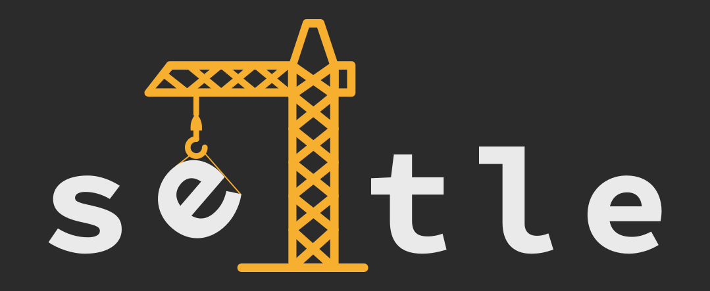
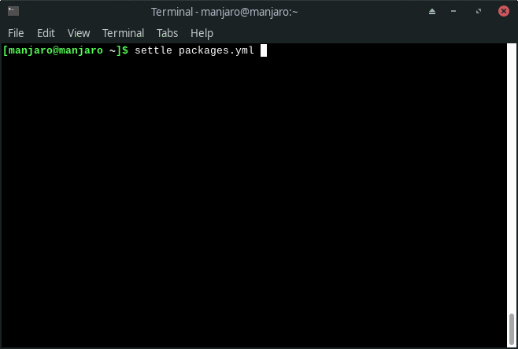

> Settle your favorite packages on your fresh installed Linux distribution

## About

Settle helps you to install your favourite packages on your fresh installed Linux
distribution.
Settle expects you to pass a simple [YAML](https://en.wikipedia.org/wiki/YAML) file
containing a list of your favourite packages, which are automatically installed by it.
Therefore you only need to keep an updated list of your favourite packages in order to
quickly install them the next time you reinstall your distro.
It can also be helpful for sysadmins that need to perform Linux installations on several
machines by saving time on the post install process.

## How does it work

You need to have a `packages.yml` file with your favourite packages grouped inside
categories. It could look something like this:

```yaml
basic:
    - git
    - gnupg
    - neovim

graphics:
    - gimp
    - inkscape

system:
    - gnome-disk-utility
    - gnome-system-monitor
```

Then run Settle:

```bash
settle packages.yml
```

Now Settle will ask you if you want update all the
installed packages and/or which packages you want to install:



By default Settle will refresh packages lists before performing any tasks in order to
avoid problems with old-dated packages.


## How to install

Currently the only way to install it is cloning the GitHub repository:

```bash
git clone https://github.com/santisoler/settle
```

And then install it:
```bash
cd settle
pip install .
```

I plan to upload Settle to [PyPI](https://pypi.org/) in the future in order to ease the
installation process.


## How to use

We need to write a `packages.yml` file containing the packages we will eventually want
to install in the future.
All packages must be grouped inside categories.
For example:

```yaml
basic:
    - git
    - gnupg
    - neovim

graphics:
    - gimp
    - inkscape

system:
    - gnome-disk-utility
    - gnome-system-monitor
```

We can then run Settle from the command line passing the `packages.yml` file as
argument:

```bash
settle packages.yml
```

Settle will ask us to choose one or more categories, so only the packages
inside the chosen categories will be installed.
Therefore we can include any package we eventually use on `packages.yml`, but choose
which packages we definitely want to install after a fresh Linux installation.

In case we know that we will always install the packages under certain categories, we
can include these categories inside a `default` section on the `packages.yml` file.
The categories under the `default` will be checked-off by default.

Following with the previous example, if we want the packages inside `basic` and `system`
to be checked-off by default, we can include them under a new `defualt` section:

```yaml
default:
    - basic
    - system

basic:
    - git
    - gnupg
    - neovim

graphics:
    - gimp
    - inkscape

system:
    - gnome-disk-utility
    - gnome-system-monitor
```

## Related projects

There are some other projects that address the same problem: make post installation
easier. Some of theme are:

- [snwh/ubunut-post-install](https://github.com/snwh/ubuntu-post-install)
- [Cyclenerd/postinstall](https://github.com/Cyclenerd/postinstall)
- [Ansible](https://github.com/ansible/ansible)

## License

All content under [MIT License](), except where noted.

Settle logo is released under
[Licencia Creative Commons Atribución 4.0 Internacional](http://creativecommons.org/licenses/by/4.0/).
It's based on an adapted version of the icon made by
[Smashicons](https://www.flaticon.com/authors/smashicons) from www.flaticon.com.
